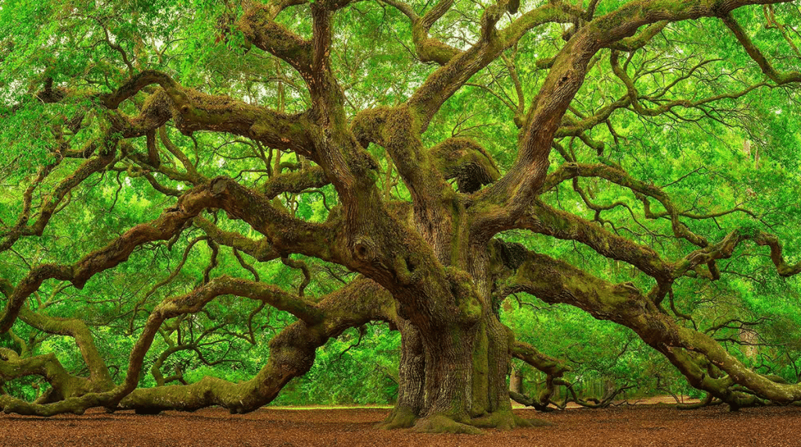
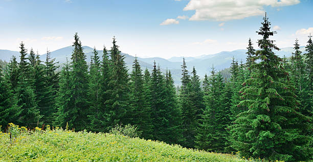

Welcome to **TreeLife**,your guide to learning about the beauty,diversity,and importance of trees around the world.
## About Us
At **TreeLife**,we're passionate about forests and green living.    
Our mission is to:
- Educate people about the different types of trees.
- Promote sustainable forestry.
- Encourage relorestation projects.
>"The best time to plant a tree was 20 years ago.The second best time is now."     
>-- Chinese Proverb

## Featured Trees
### Oak Tree
**Scientific Name:** *Quercus robur*       
Know for its strenght and longevity,the oalk is a symbol of endurance.

### Pine Tree 
**Scientific Name:** *Pinus*    
Evergreeb and aromatic,pine trees thrive in colder regions.   

## Tree Identical Tool
You can use this simple **Javascript** function to identify a tree bt its characteristics:

function identify_tree(leaf_shape, region)(
    if (leaf_shape )
)